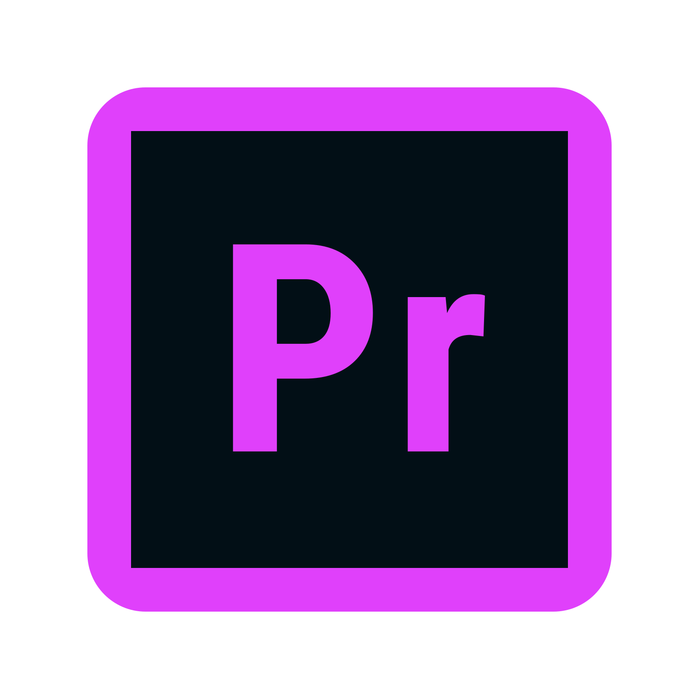

  

  

  
<h1 align="center">
  
</h1>

  
  

  

###  About Me

I am a student at Politeknik Negeri Medan pursuing a Diploma in Management Information (2023-2026).  
I specialize in full-stack development with a focus on web technologies.

  

## 🛠️ Skills

  

### Programming Languages

  &nbsp;
  &nbsp;
  &nbsp;
  &nbsp;
  &nbsp;
  

### Web Technologies

  &nbsp;
  &nbsp;
  &nbsp;
  

### Tools & Technologies

  &nbsp;
  &nbsp;
  &nbsp;
  &nbsp;
  &nbsp;
  

---

## 🚀 Projects

### Warung UMKM  
- A web-based cashier application and e-commerce platform  
- **Technologies Used:**  
   JavaScript,  
   Tailwind CSS,  
   PHP,  
   MySQL  

---

  

## 📫 Contact

  
  

---

## 🎓 Education

- **Politeknik Negeri Medan**  
  - 📚 Diploma of Management Information  
  - 🗓️ 2023-2026  

---

## 🎨 Portfolio

  Check out my portfolio website for more detailed information about my work and projects:
   
  

- 🎯 Showcasing my full-stack development projects
- 🎨 Featuring UI/UX designs and creative work
- 💼 Comprehensive overview of my technical skills
- 📱 Responsive web design implementations

## 📊 GitHub Statistics

  

  

  

  

### 🔥 Streak Stats

  

### ⚡ Recent GitHub Activity

  

