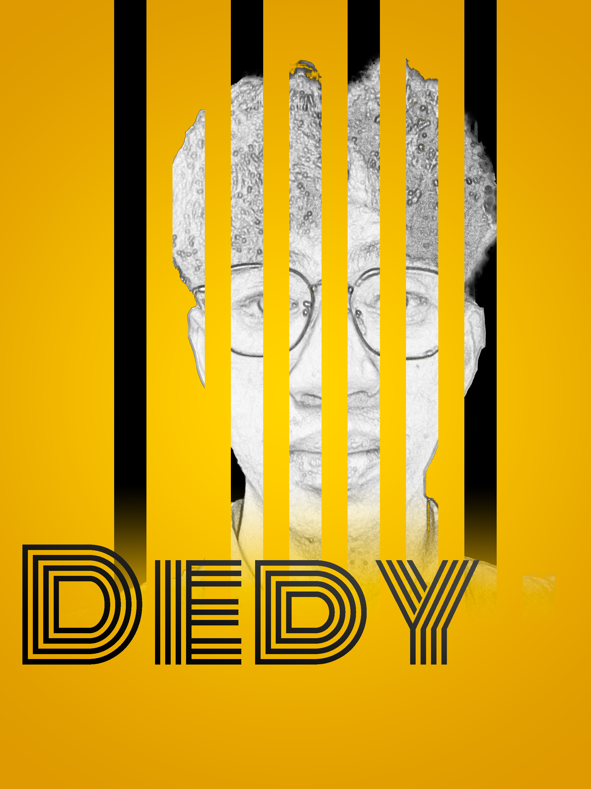
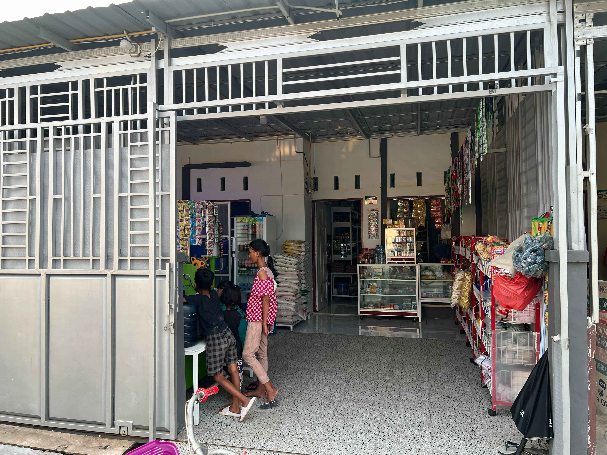
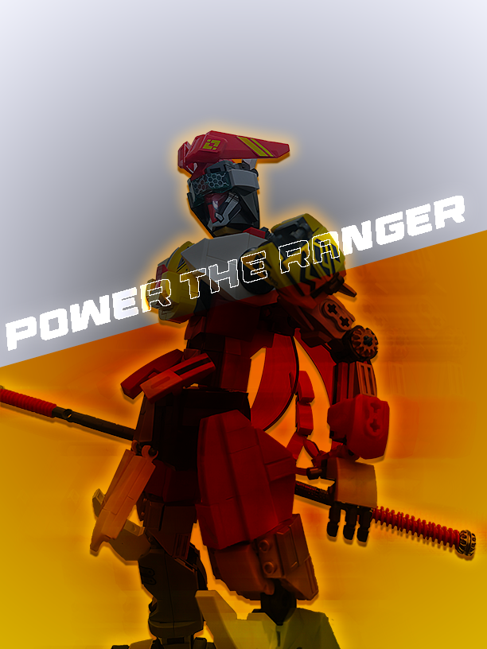

  
  
  <h1>
    
  </h1>
  
  

    
    
    
    
  

## 👨‍💻 About Me

> Student at Politeknik Negeri Medan pursuing a Diploma in Management Information (2023-2026).
> Full-stack developer with a passion for web technologies and creative design solutions.

  

## 🛠️ Tech Stack

### Programming Languages

  
  
  
  
  
  

### Tools & Software

  
  
  
  
  
  

## 📜 Certifications

  
  
  
Verified GitHub Foundations professional certification demonstrating proficiency in GitHub fundamentals, collaboration workflows, and version control best practices.

## 🎨 Portfolio Highlights

<table>
  <tr>
    <td width="50%">
      <h3 align="center">Creative Design - Shoes</h3>
      

        
      

    </td>
    <td width="50%">
      <h3 align="center">Character Design</h3>
      

        
      

    </td>
  </tr>
  <tr>
    <td width="50%">
      <h3 align="center">Web Development</h3>
      

        
      

    </td>
    <td width="50%">
      <h3 align="center">Power Ranger!!</h3>
      

        
      

    </td>
  </tr>
</table>

## 📊 GitHub Stats

  
  

  

  

  

  

